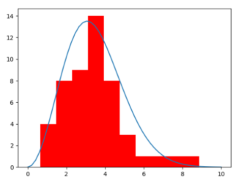

# Classical-gas-of-particles
With this code I analyze the behavior of a classical gas of particles. I implement the **graphics.py** library to plot in real time the motion of every simulated particle. Then 
I plot the histogram of the particles' velocities, which should relax to a Maxwell-Boltzmann distribution:\\
$$f(v)d^3v = \left(\frac{m}{2\pi k T}\right)^{3/2} \exp{-\left(\frac{mv^2}{2kT}\right)}d^3v$$
The following figures epresent a certain istant in the simulation:

 

